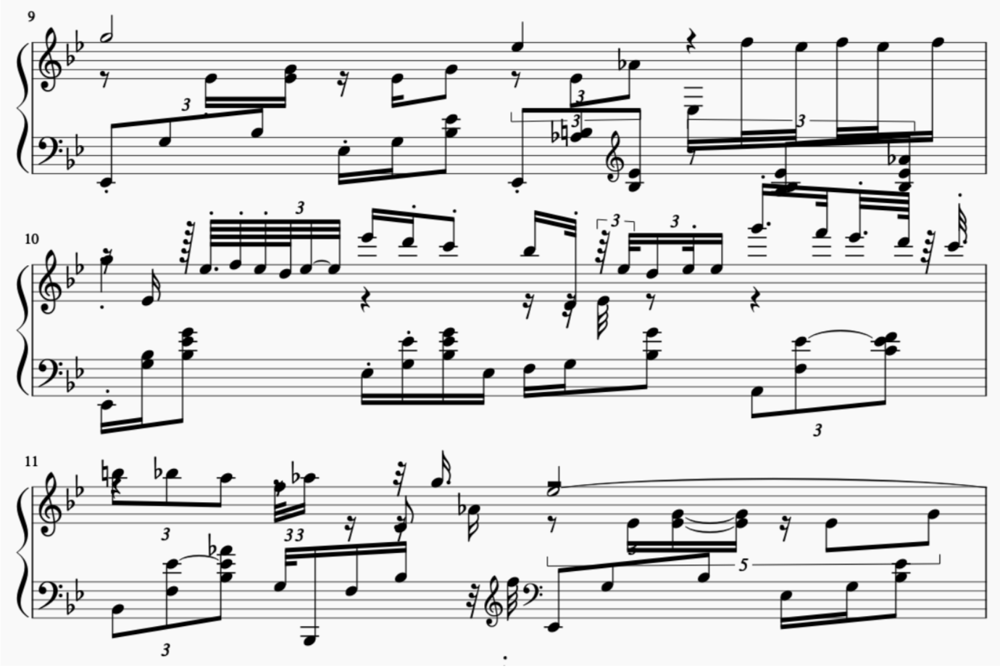

# Compose polyphonic piano pieces using RNN

- **Goal**: Create a prototype model that is able to compose polyphonic piano pieces with duration changes in notes.
- Presentation slides: [[link to google slides](https://docs.google.com/presentation/d/1a5Yw3-MNF8Zgr4MNjVyIDd6EQc1GcqU7cIvmupgWjpM/edit?usp=sharing)]
- Project report: [[link to pdf](https://drive.google.com/file/d/1NUtBRJjuNGEqsSulpDBzb65V6U50WA5E/view?usp=sharing)]

### References:
- https://towardsdatascience.com/generate-piano-instrumental-music-by-using-deep-learning-80ac35cdbd2e
- https://towardsdatascience.com/how-to-generate-music-using-a-lstm-neural-network-in-keras-68786834d4c5
- Pypianoroll official documentation: https://salu133445.github.io/pypianoroll/getting_started.html
